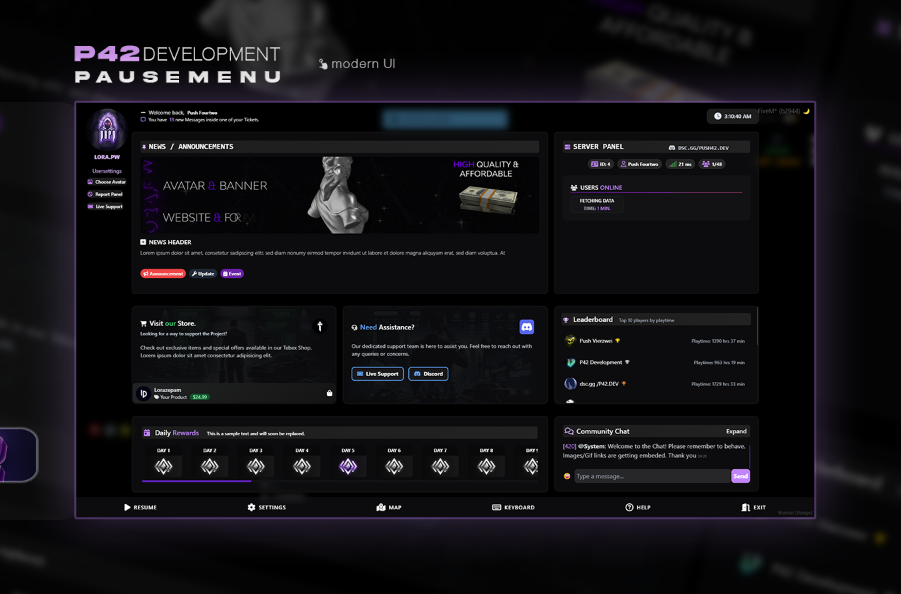
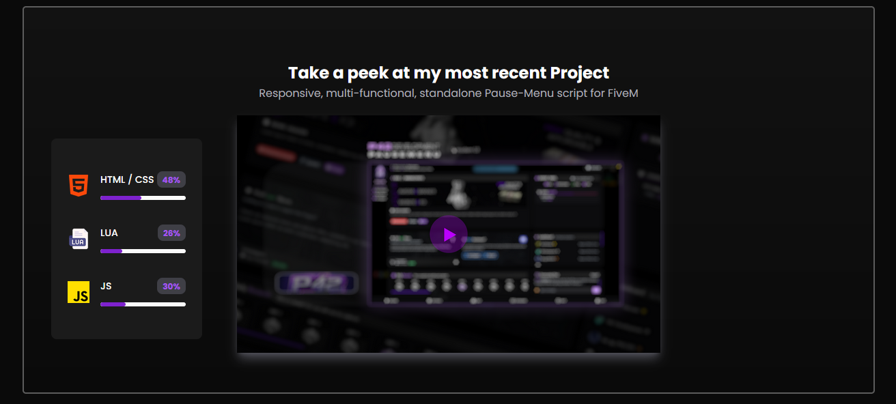
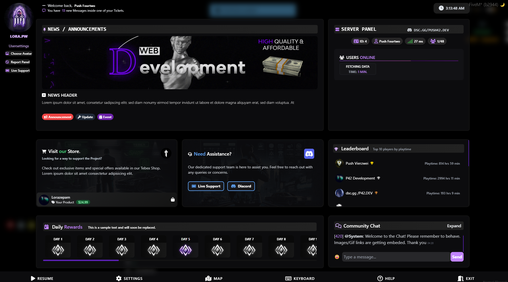
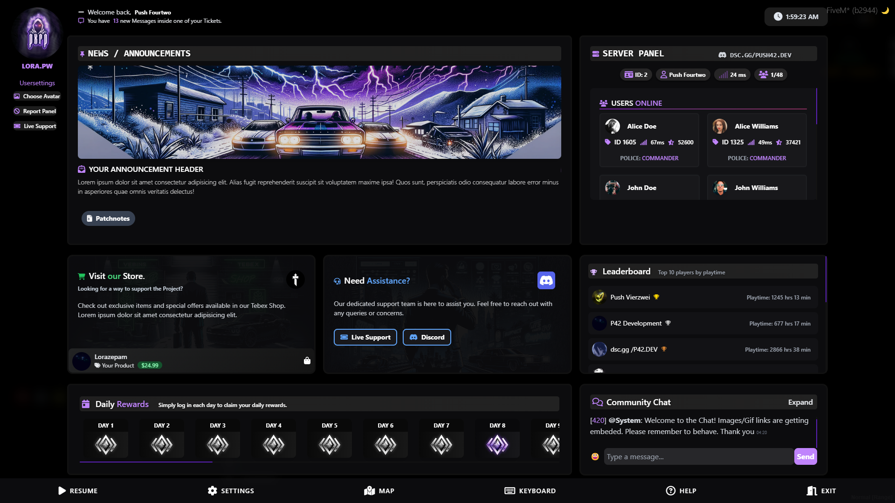
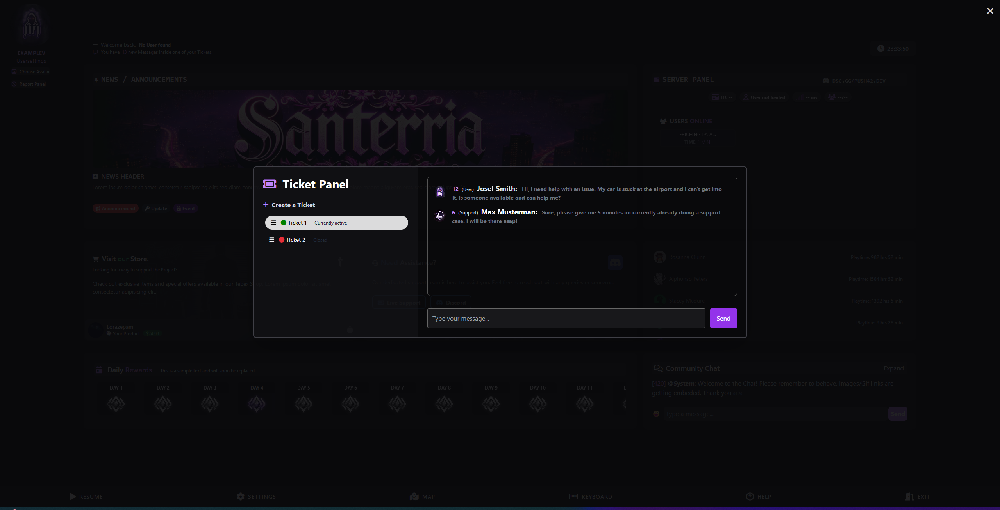

# 🎮 FiveM Pause Menu UI (Abandoned Project)

**Author:** Push.42  
**Status:** Abandoned / Unfinished  
**License:** Free to use, modify, and redistribute  
**Last Active:** ~2 Years Ago  
**Intended Use:** Custom Pause Menu Replacement for FiveM servers

⭐ If this helped you, consider starring the repo to support future open-source projects.

---

## 📌 About

This is a **custom pause menu UI** created for the FiveM platform, offering a sleek, dark-themed interface tailored for RP servers. It was developed with modular design in mind, giving players and admins a richer experience than the default menu.

⚠️ **This project is abandoned.** It is no longer maintained and may contain unfinished or partially implemented features.

You are **free to use, edit, or redistribute** this script however you want. No credit required, but appreciated.

---

## 🧩 Features

- ✅ Fully custom-designed pause menu UI  
- ✅ News & Announcements panel  
- ✅ Server panel (shows player ID, ping, player count)  
- ✅ Online user list  
- ✅ **Leaderboard – functional, data-driven**  
- ✅ **Community Chat – fully working and live**  
- ✅ Tebex store promotional card  
- ✅ Discord / Support panel  
- ✅ Daily rewards UI layout (**unfinished logic**)  
- ✅ Report panel buttons  
- ✅ Basic Discord webhook support (e.g. for reports)  
- ✅ Player identity (e.g. `"Push Vierzwei"`) fetched from database/framework

---

## 🚧 Unfinished / Missing Features

- ❌ **Daily Rewards System** – UI present, logic not completed  

---

## 🔌 Database Integration

- ✅ Pulls player identity dynamically using your active framework (e.g. ESX, QBCore)  
- ✅ Leaderboard and chat are fully functional and **interact with your server backend**  
- ❌ Daily rewards system and reports do not yet persist data in a database

To extend integration, you can connect features like Daily Rewards or advanced reporting to a MySQL database using `oxmysql` or `mysql-async`.

---

## 🔗 Discord Webhook Integration

- ✅ Includes **basic webhook support** – reports or alerts can be sent to a Discord server  
- ❌ Some buttons or triggers may need further configuration or backend logic depending on your server setup

---

## 📂 Installation

1. Place the resource in your server's `resources` folder.  
2. Make sure the folder is named appropriately (e.g. `pausemenu`).  
3. Add the resource to your `server.cfg`:
